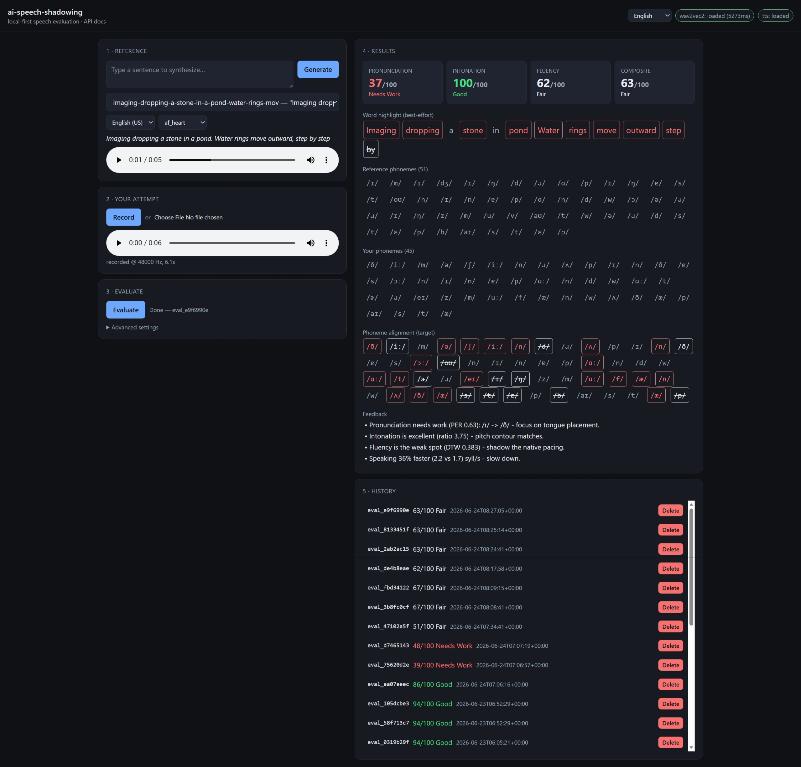

# ai-speech-shadowing

A local-first speech evaluation engine for language learning via the **shadowing technique**. Compare recorded user audio against native TTS reference clips and get multi-dimensional feedback on **pronunciation, prosody, and fluency** — entirely offline, with zero per-evaluation cost.

**Scoring blends three pillars:** pronunciation (did you produce the right sounds, via a phoneme model trained on learner speech), intonation (did your pitch rise and fall like the reference), and fluency (did your pacing and rhythm match).

> **Status:** Alpha — core engine, REST API, interactive demo, and Docker all complete (Phases 0–8). Phase 9 (optimization) and Phase 10 (full web UI) pending.

For the full architecture, roadmap, and API specification, see [`docs/README.md`](docs/README.md).
For a head-to-head scoring comparison against ELSA Speak, see [`docs/elsa-comparison.md`](docs/elsa-comparison.md).

## Demo

[](https://youtu.be/ikQmdSpkKCg)

[**▶ Watch the full walkthrough on YouTube**](https://youtu.be/ikQmdSpkKCg) — mic recording, reference generation, and multi-dimensional feedback (pronunciation, intonation, fluency).



## Quick start

```bash
uv sync                                # create .venv and install deps (espeak-ng is vendored)
uv run ai-speech-shadowing serve       # API + demo on http://localhost:8000
# or: bash scripts/serve.sh            # HTTPS (needed for mic on non-localhost)
```

Then open **http://localhost:8000/** — pick a reference, record your attempt,
and get instant feedback. (First evaluation loads the models, ~10s.)

For LAN/mobile access, use `bash scripts/serve.sh` — it auto-generates a
self-signed TLS cert so the microphone works from other devices.

## Practice sentences

The repo ships with **30 pre-generated Kokoro references** (`data/references/`)
covering common workplace English — meetings, deadlines, code review, small
talk, and more. See [`data/default.txt`](data/default.txt) for the full list.
Each reference carries a cached G2P phoneme block
(`metadata.json["phonemes"]`) so evaluations skip acoustic recognition on the
reference side entirely. Pick one in the demo, record your attempt, and get
instant feedback.

To add your own:

```bash
just serve                              # web UI — type a sentence, click Generate
uv run ai-speech-shadowing generate-reference --list data/default.txt  # batch from CLI
```

## How scoring works

Each evaluation produces a weighted composite score (0–100) from three
independent pillars:

| Pillar | Weight | Signal | Source |
| --- | :---: | --- | --- |
| Pronunciation | **40%** | Phoneme Error Rate (PER) | L2-English Wav2Vec2 + G2P diff |
| Intonation | **30%** | Pitch-range ratio | Parselmouth (Praat) F0 extraction |
| Fluency | **30%** | DTW spectral distance | librosa MFCC + fastdtw |

Grades: `≥80` good 🟢 · `≥50` fair 🟡 · `<50` needs_work 🔴

- **Pronunciation** decodes your audio with a phoneme model **trained on
  non-native English learner speech** (Korean L2 data, annotated with
  pronunciation errors), maps the output to the same espeak-IPA notation the
  reference uses, and computes PER against the kokoro G2P target.
  Score = `(1 − PER) × 100`.
- **Intonation** compares the width of your F0 pitch excursion to the
  reference's. A monotone delivery is flagged when your range falls below a
  threshold. Score = `min(1, ratio) × 100`.
- **Fluency** aligns your MFCC feature matrix against the reference's with
  dynamic time warping. Score = `max(0, 1 − DTW_distance / scale) × 100`.
  Syllable rate and pause count are tracked for feedback text.

The phoneme backend is **pluggable** via the `PHONEME_MODEL` env var: the
default `slplab-l2` recognizes accented speech; the multilingual `espeak`
backend is available as a fallback. See
[`docs/phoneme-extraction.md`](docs/phoneme-extraction.md) and
[`docs/feedback-scoring.md`](docs/feedback-scoring.md) for details.

## Development

After cloning, install dependencies and activate the project-local Git hooks:

```bash
uv sync                               # install runtime + dev deps into .venv
git config core.hooksPath githooks    # use the project's hooks (ruff on commit)
```

Common tasks (see [`Justfile`](Justfile), run `just` to list):

```bash
just sync        # uv sync — install runtime + dev deps
just lint        # ruff check
just format      # ruff format
just test        # pytest
just verify      # lint + format-check + test (CI gate)
just explore "Hello world"   # run the Kokoro TTS explorer
```

Equivalent raw commands:

```bash
uv run ruff check .                   # lint
uv run ruff format .                  # format
uv run pytest                         # run the test suite
```

The `pre-commit` hook runs `ruff check` and `ruff format --check`. Bypass it
for a single commit with `git commit --no-verify`. See [`githooks/README.md`](githooks/README.md)
for details.

## License

MIT — see [`LICENSE`](LICENSE).
