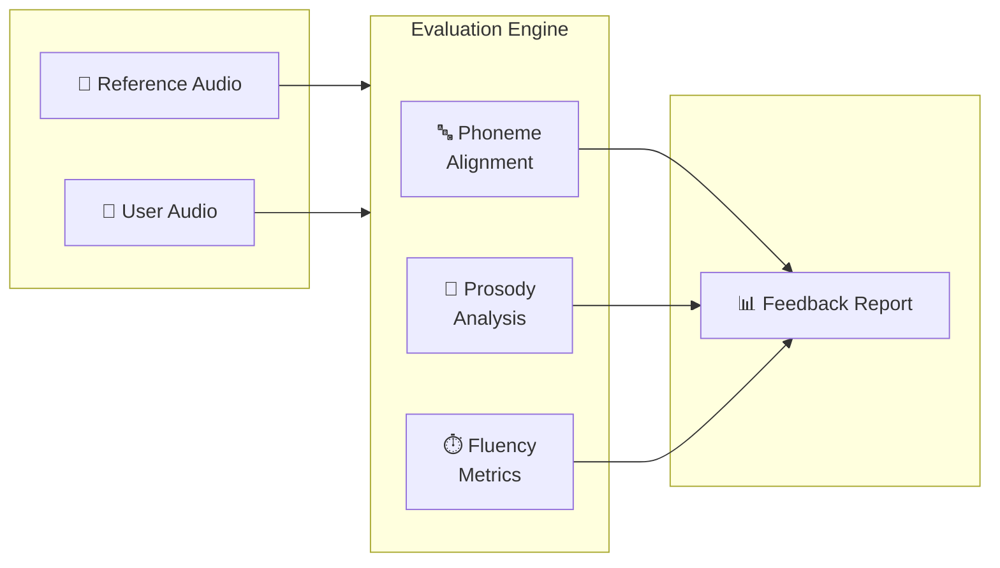
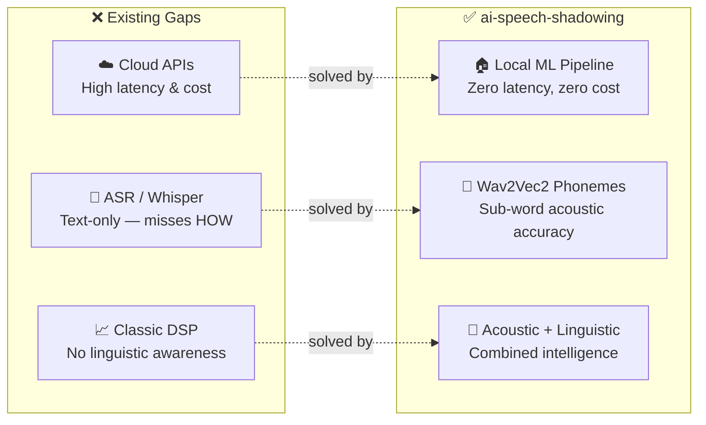
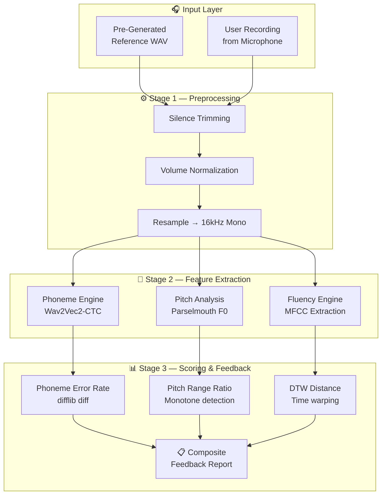
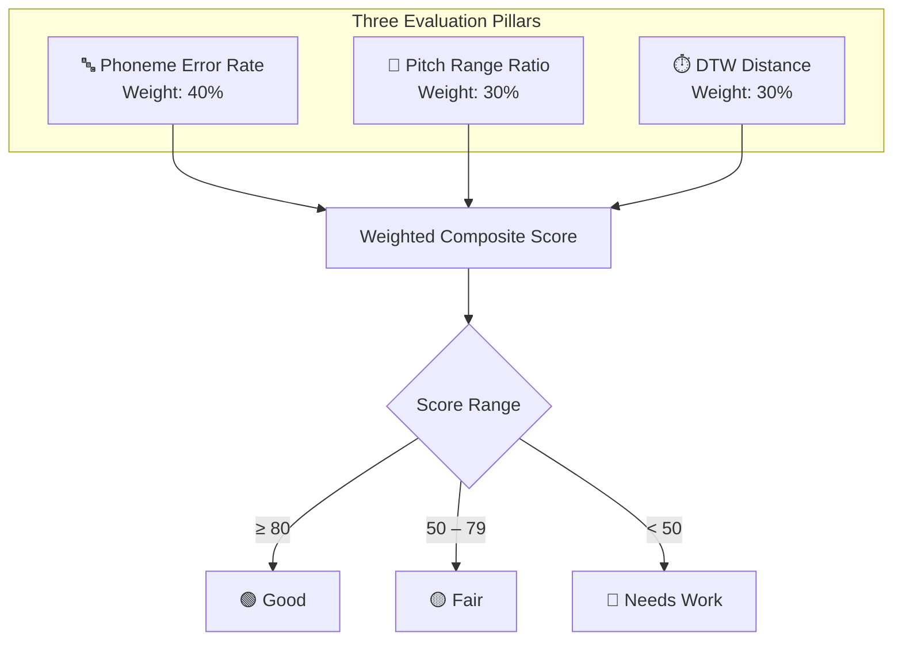
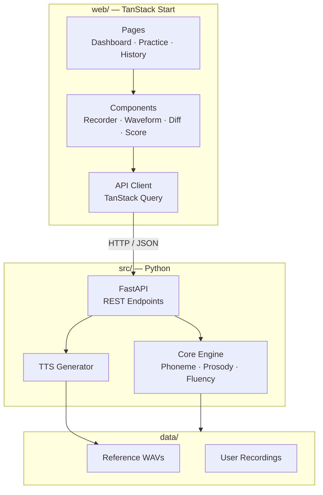
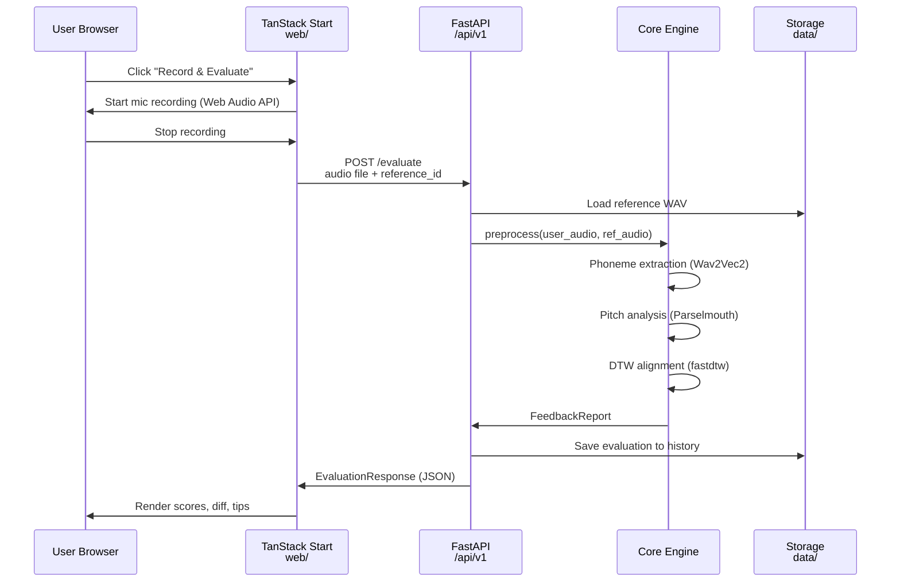

# AI Speech Shadowing 🎙️

An open-source, localized speech evaluation engine that pairs native-speaker text-to-speech (TTS) reference files against recorded user audio to deliver immediate, multi-dimensional feedback on **Pronunciation Accuracy, Fluency, and Intonation**.

> **Status:** 🧪 Alpha — Core engine, CLI, REST API & demo UI complete (Phases 0–8). Optimization & full web UI pending (Phases 9–10).

---

## Table of Contents

- [🎯 WHAT is it?](#-what-is-it)
- [💡 WHY build it?](#-why-build-it-the-problem-vs-the-solution)
- [🛠️ HOW does it work?](#️-how-does-it-work-the-architecture)
- [🧱 Tech Stack](#-tech-stack)
- [🗺️ Phase-Based Development Plan](#️-phase-based-development-plan)
- [📂 Planned Project Structure](#-planned-project-structure)
- [🌐 REST API Specification](#-rest-api-specification)
- [📝 Design Notes & Decisions](#-design-notes--decisions)
- [🔮 Future Ideas & Exploration](#-future-ideas--exploration)

---

## 🎯 WHAT is it?

`ai-speech-shadowing` is a Python-based developer framework and personal utility designed to automate the **Shadowing Technique** for language learning. Instead of relying on expensive, high-latency cloud APIs, this project provides a completely private, local machine-learning pipeline that acts as an automated speech coach.

The engine breaks down audio analysis into three distinct pillars:

- **Phoneme-Level Alignment:** Maps exactly what you said down to individual mouth movements and sound units.
- **Acoustic Prosody Analysis:** Measures the pitch contours ($F_0$) and cadence of your voice to see if you sound natural or monotone.
- **Temporal Fluency Metrics:** Tracks syllables-per-second, speech velocity, and unnatural pauses.



---

## 💡 WHY build it? (The Problem vs. The Solution)

### The Problem with Existing Solutions

1. **High Cloud Latency & Cost:** Commercial assessment APIs (e.g., Azure, ELSA) become expensive at scale and require a continuous internet connection, introducing feedback latency that breaks the rhythm of high-speed practice.
2. **The "Text-Only" Deficit:** Standard Automatic Speech Recognition (ASR) tools like Whisper only tell you *what* word you said, completely missing *how* you said it. If you mispronounce a vowel but the model guesses the word via context, you receive zero corrective feedback.
3. **Acoustic Naivety of Classic DSP:** Standard digital signal processing (DSP) libraries like Librosa can match audio wave physics (volume, speed) but have no inherent concept of linguistics or phonetic structures.

### Our Solution

`ai-speech-shadowing` combines the linguistic intelligence of speech transformers with the precision of acoustic signal processing. By pre-generating your native target clips using high-fidelity native TTS models (like Qwen TTS), you establish a local "Gold Standard" directory. The engine then uses localized machine learning to evaluate your voice attempts directly against those static references in milliseconds.



---

## 🛠️ HOW does it work? (The Architecture)

The system passes the target reference audio and the user recording through a multi-stage local processing pipeline:



### 1. Audio Preprocessing (`librosa`)

Raw audio from a microphone can contain variable lead-in silence or volume variances. The engine utilizes Librosa to:

- Apply top-decibel split thresholds (`librosa.effects.split`) to cleanly strip trailing and leading silence so comparisons are time-fair.
- Force resample all inputs to a rigid 16kHz mono signal, matching the precise input requirements of deep acoustic transformer models.

### 2. Phonetic Sub-System (`transformers` & Wav2Vec2)

To catch minute accent or sound variations (e.g., distinguishing between short and long vowels), the pipeline avoids raw text:

- Both the reference wave and user wave are processed via Meta's **Wav2Vec2-CTC** model fine-tuned on the International Phonetic Alphabet (`espeak-phoneme-id`).
- The raw logits are converted into phonetic sequences. A standard Python sequence-matching algorithm (`difflib.SequenceMatcher` / `difflib.ndiff`) highlights precise phoneme omissions, substitutions, or insertions.

### 3. Prosody & Pitch Contour (`praat-parselmouth`)

To prevent flat or robotic deliveries, the system matches the musicality of speech:

- Using **Parselmouth**, a Python interface for the classic Praat phonetics software, the engine extracts the Fundamental Frequency ($F_0$) over the audio duration.
- It computes the average pitch, maximum pitch spikes, and total active pitch range. If the user's pitch range drops below a calculated percentage of the native target, the script flags a "monotone delivery warning."

### 4. Pacing & Time Realignment (`fastdtw`)

Because a user might speak slower or faster than the native reference without necessarily making an error, standard time-series data fails:

- The system extracts Mel-Frequency Cepstral Coefficients (MFCCs) via Librosa to map the acoustic density of the sound.
- It passes these matrices through **Dynamic Time Warping (DTW)** using an Euclidean distance metric. This mathematical algorithm stretches and bends the time axis of the user's audio to track exactly how well the phonetic rhythm matches the reference, providing a final numerical score of physical speech similarity.

---

## 🧱 Tech Stack

| Layer              | Technology                          | Role                                          |
| ------------------ | ----------------------------------- | --------------------------------------------- |
| **Language**       | Python 3.10+                        | Backend runtime                               |
| **Audio I/O**      | `sounddevice` / `soundfile`         | Mic recording & WAV read/write                |
| **Preprocessing**  | `librosa`                           | Resampling, silence trimming, MFCC extraction |
| **Phoneme Engine** | `transformers` + Wav2Vec2-CTC       | Phoneme-level speech recognition              |
| **Pitch Analysis** | `praat-parselmouth`                 | F0 fundamental frequency extraction           |
| **Time Alignment** | `fastdtw` + `scipy`                 | Dynamic Time Warping distance                 |
| **TTS Reference**  | Kokoro (Real-time) / Qwen TTS (Offline) | Gold-standard native audio generation         |
| **Diff Engine**    | `difflib` (stdlib)                  | Phoneme sequence comparison                   |
| **REST API**       | `FastAPI` + `uvicorn`               | HTTP API layer serving the evaluation engine  |
| **CLI**            | `Typer`                             | Developer command-line interface              |
| **Frontend**       | TanStack Start (React + Vinxi)      | Fullstack React web app with SSR              |
| **Styling**        | Tailwind CSS                        | Utility-first CSS framework                   |

---

## 🗺️ Phase-Based Development Plan

---

### Phase 0 — Project Scaffolding & Environment ✅

> **Goal:** Establish a clean, reproducible development foundation.
> **Done** — `pyproject.toml` (uv), ruff config, `Justfile`, `githooks/`, `tests/`, and `docs/` are all in place.

- [x] Initialize Python project with `pyproject.toml` (or `setup.cfg`)
- [x] Set up dependency management (`uv` / `pip-tools` / `poetry`)
- [x] Create virtual environment & pin Python version
- [x] Add `.gitignore`, `LICENSE`, linting config (`ruff` / `black`)
- [x] Set up basic `Makefile` or `justfile` for common tasks
- [x] Create initial `docs/` structure (this file ✅)
- [x] Set up `tests/` directory with pytest scaffolding

**Deliverable:** A runnable, empty project skeleton with CI-ready structure.

---

### Phase 1 — Audio Preprocessing Pipeline ✅

> **Goal:** Build the foundational audio I/O and normalization layer.
> **Done** — see [`audio-preprocessing.md`](audio-preprocessing.md) for the full API reference.

- [x] Implement WAV file loader with format validation
- [x] Build resampling utility → force all audio to **16kHz mono**
- [x] Implement silence trimming via `librosa.effects.split`
- [x] Add optional volume normalization (peak / RMS normalization)
- [x] Write unit tests with fixture WAV files
- [x] Create a `preprocess` CLI command for standalone testing

**Key Design Decision:** All downstream modules receive a standardized `AudioSample` dataclass: `(waveform: np.ndarray, sample_rate: int = 16000)`.

---

### Phase 2 — Phoneme Extraction & Comparison ✅

> **Goal:** Achieve phoneme-level pronunciation feedback.
> **Done** — see [`phoneme-extraction.md`](phoneme-extraction.md) for the full API reference.

- [x] Integrate `transformers` + Wav2Vec2-CTC phoneme model
- [x] Implement CTC decoding → raw phoneme sequence extraction
- [x] Build phoneme diff engine using `difflib.SequenceMatcher`
- [x] Generate human-readable diff output (insertions / deletions / substitutions)
- [x] Compute Phoneme Error Rate (PER) as a numeric score
- [x] Test with known-good vs. known-bad pronunciation pairs
- [x] Handle edge cases: empty audio, very short clips, noise-only input

**Key Metric:** `Phoneme Error Rate (PER)` — lower is better.

---

### Phase 3 — Pitch & Prosody Analysis ✅

> **Goal:** Detect monotone delivery and compare intonation curves.
> **Done** — see [`pitch-prosody.md`](pitch-prosody.md) for the full API reference. (Pitch contour visualization is deferred to the Phase 8 web UI.)

- [x] Integrate `praat-parselmouth` for F0 extraction
- [x] Compute pitch statistics: mean, median, max, min, range, std-dev
- [x] Build reference vs. user pitch range comparison
- [x] Implement monotone detection threshold (configurable %)
- [ ] Optionally: generate pitch contour visualization (matplotlib / plotly)  → deferred to Phase 8 web UI
- [x] Add prosody sub-score to the feedback report

**Key Metric:** `Pitch Range Ratio` — user pitch range / reference pitch range.

---

### Phase 4 — Fluency & Timing (DTW) ✅

> **Goal:** Evaluate pacing, rhythm, and temporal alignment.
> **Done** — see [`fluency-timing.md`](fluency-timing.md) for the full API reference.

- [x] Extract MFCC feature matrices from both audio signals
- [x] Implement DTW alignment via `fastdtw` + Euclidean distance
- [x] Compute normalized DTW distance score
- [x] Detect abnormal pauses (silence gaps > threshold within speech)
- [x] Calculate syllable rate (syllables per second approximation)
- [x] Add timing sub-score to the feedback report

**Key Metric:** `DTW Distance` (normalized) — lower means closer rhythm match.

---

### Phase 5 — Feedback Engine & Scoring ✅

> **Goal:** Unify all sub-scores into a coherent, actionable feedback report.
> **Done** — see [`feedback-scoring.md`](feedback-scoring.md) for the full API reference.

- [x] Design `FeedbackReport` data model combining all three pillars
- [x] Implement weighted composite score (configurable weights)
- [x] Generate textual feedback with specific improvement suggestions
- [x] Color-coded severity levels (e.g., 🟢 Good / 🟡 Fair / 🔴 Needs Work)
- [x] Support JSON output for programmatic consumption
- [x] Support Markdown / terminal-pretty output for human consumption
- [x] Write integration tests: full pipeline from audio → report

**Example Output:**
```
╔══════════════════════════════════════════════╗
║        AI Speech Shadowing — Report         ║
╠══════════════════════════════════════════════╣
║ Pronunciation (PER):   0.12  🟢 Good        ║
║ Intonation (Pitch):    0.68  🟡 Fair         ║
║ Fluency (DTW):         0.45  🟢 Good        ║
║──────────────────────────────────────────────║
║ Composite Score:       74/100               ║
╠══════════════════════════════════════════════╣
║ 💡 Tip: Your pitch range is narrower than   ║
║    the reference. Try exaggerating the      ║
║    rising tone on question endings.         ║
╚══════════════════════════════════════════════╝
```



---

### Phase 6 — TTS Reference Generation ✅

> **Goal:** Automate gold-standard native audio creation.
> **Done** — see [`tts-reference.md`](tts-reference.md) for the full API reference.

- [x] Integrate **Kokoro** TTS for lightning-fast, real-time reference generation
- [x] Provide instructions/scripts for users to generate high-fidelity offline references (e.g., using Qwen TTS) and organize them manually
- [x] Build a `generate-reference` CLI command: text → WAV (via Kokoro)
- [x] Support batch generation from a sentence list file
- [x] Organize references using a short slug directory structure (e.g., `data/references/hello-world/`)
- [x] Add `metadata.json` to each slug folder (text, language, default speaker)
- [x] Store audio files within a voice profile subfolder (e.g., `data/references/hello-world/audio/kokoro-en-us/`)
- [x] Cache & skip regeneration if reference already exists

---

### Phase 7 — CLI Interface ✅

> **Goal:** Provide a developer-friendly command-line workflow.
> **Done** — see [`cli.md`](cli.md) for the full command reference.

- [x] Implement CLI with `Typer` (or `Click`)
- [x] Commands:
  - `record` — Record user audio from microphone
  - `evaluate` — Run full pipeline on a user + reference pair
  - `generate-reference` — Generate reference audio from text  *(named `generate-reference` per the Phase 6 spec)*
  - `batch` — Evaluate a directory of recordings
  - `report` — View past evaluation reports
- [x] Add `--verbose` / `--json` / `--quiet` output flags  *(global `--verbose`/`--quiet`; JSON via per-command `--format json`)*
- [x] Add progress bars for long operations (model loading, batch eval)
- [x] Write CLI integration tests

---

### Phase 8 — REST API & Web UI ✅

> **Goal:** Expose the engine via HTTP and build a modern web interface.

This phase is split into two parallel tracks:

#### 8A — FastAPI Backend ✅

> **Done** — see [`rest-api.md`](rest-api.md) for the full API reference. Includes `scripts/test_e2e.py` exercising the whole flow over real HTTP.

- [x] Set up FastAPI app with `uvicorn` server
- [x] Implement REST endpoints (see [REST API Specification](#-rest-api-specification) below)
- [x] Add multipart file upload for audio (WAV/WebM/MP3)
- [x] Add request validation with Pydantic models
- [x] Implement async evaluation pipeline for non-blocking requests  *(sync `def` handlers run in FastAPI's threadpool)*
- [x] Add CORS middleware for local frontend dev
- [x] Add OpenAPI docs auto-generation (`/docs`, `/redoc`)
- [x] Write API integration tests with `httpx` / `TestClient`  *(+ `scripts/test_e2e.py` over real HTTP)*

#### 8B — Single-page Demo (`GET /`) ✅

> **Done** — a self-contained `demo.html` served by the API at `GET /`
> (no build step, vanilla JS). Showcases **every** feature: mic record-to-WAV,
> file upload, reference generation + playback, full + quick evaluation,
> colour-coded phoneme diff, score cards, feedback, and history. The full
> TanStack Start SPA was deferred to [Phase 10](#phase-10--full-web-ui-tanstack-start-).

- [x] Serve a single hardcoded `demo.html` from the FastAPI app
- [x] Microphone recording (Web Audio API → in-browser WAV encode) + `.wav` upload
- [x] Text → TTS reference generation; list + play existing references
- [x] Evaluate (pre-generated reference) + quick-evaluate (text) → instant feedback
- [x] Colour-coded phoneme diff, score cards, feedback list
- [x] Browse past evaluations from history
- [x] Health / model-load status indicator

---

### Phase 9 — Optimization & Polish

> **Goal:** Production-grade performance and reliability.

- [ ] Profile and optimize model loading time (lazy loading, caching)
- [ ] Benchmark end-to-end latency (target: < 2 seconds per evaluation)
- [ ] Add GPU acceleration support (CUDA / MPS) for transformer inference
- [ ] Implement audio input validation and graceful error handling
- [ ] Add logging with structured log output
- [ ] Write comprehensive documentation (API docs, usage guides)
- [ ] Set up CI/CD pipeline (GitHub Actions)
- [ ] Add pre-commit hooks (ruff, mypy, pytest)

---

### Phase 10 — Full Web UI (TanStack Start)

> **Goal:** The production-grade React SPA (`web/`) for daily practice. Deferred from the
> original Phase 8B; the lightweight `/` demo HTML already showcases every feature.
> Details in `tmp/phase_10_web_ui.md`.

---

## 📂 Planned Project Structure

```
ai-speech-shadowing/
├── docs/
│   └── README.md                 # This file — project vision & plan
├── src/
│   └── ai_speech_shadowing/
│       ├── __init__.py
│       ├── cli.py                # CLI entry point (Typer)
│       ├── core/
│       │   ├── __init__.py
│       │   ├── audio.py          # AudioSample dataclass & I/O
│       │   ├── preprocess.py     # Resampling, trimming, normalization
│       │   ├── phoneme.py        # Wav2Vec2 phoneme extraction & diff
│       │   ├── prosody.py        # Parselmouth F0 pitch analysis
│       │   ├── fluency.py        # MFCC + DTW timing analysis
│       │   └── feedback.py       # FeedbackReport aggregation & scoring
│       ├── api/
│       │   ├── __init__.py
│       │   ├── app.py            # FastAPI application factory
│       │   ├── routes/
│       │   │   ├── __init__.py
│       │   │   ├── evaluate.py   # POST /evaluate — audio evaluation
│       │   │   ├── reference.py  # /references — TTS management
│       │   │   ├── history.py    # /history — past evaluations
│       │   │   └── health.py     # GET /health — service health
│       │   ├── schemas.py        # Pydantic request/response models
│       │   └── deps.py           # Shared dependencies (engine singletons)
│       ├── tts/
│       │   ├── __init__.py
│       │   └── generator.py      # TTS reference generation
│       └── utils/
│           ├── __init__.py
│           └── config.py         # Settings, thresholds, model paths
├── web/                           # TanStack Start frontend (separate app)
│   ├── package.json
│   ├── app.config.ts             # TanStack Start / Vinxi config
│   ├── tsconfig.json
│   ├── app/
│   │   ├── routes/
│   │   │   ├── __root.tsx        # Root layout
│   │   │   ├── index.tsx         # Home / dashboard
│   │   │   ├── practice.tsx      # Recording & evaluation page
│   │   │   └── history.tsx       # Past attempts & progress
│   │   ├── components/
│   │   │   ├── AudioRecorder.tsx  # Mic recording widget
│   │   │   ├── WaveformView.tsx   # Audio waveform visualization
│   │   │   ├── PitchContour.tsx   # F0 pitch chart
│   │   │   ├── PhonemeDiff.tsx    # Color-coded phoneme diff
│   │   │   └── ScoreCard.tsx      # Evaluation score display
│   │   └── lib/
│   │       └── api.ts            # API client (fetch wrapper)
│   └── public/
│       └── favicon.ico
├── tests/
│   ├── conftest.py
│   ├── fixtures/                 # Test WAV files
│   ├── test_preprocess.py
│   ├── test_phoneme.py
│   ├── test_prosody.py
│   ├── test_fluency.py
│   ├── test_feedback.py
│   └── test_api.py               # FastAPI endpoint tests
├── data/
│   ├── references/               # Gold-standard TTS-generated WAVs
│   │   └── short-slug-name/      # Grouped by phrase/sentence
│   │       ├── metadata.json     # Text, language, and original source info
│   │       └── audio/
│   │           ├── kokoro-en/    # Real-time generated voice profile
│   │           │   └── ref.wav
│   │           └── qwen-en/      # Offline high-fidelity voice profile
│   │               └── ref.wav
│   └── recordings/               # User recorded attempts
├── pyproject.toml
├── Makefile
├── docker-compose.yml            # Optional: run API + web together
├── .gitignore
├── LICENSE
└── README.md                     # User-facing README (short version)
```



---

## 🌐 REST API Specification

The FastAPI backend exposes a clean REST API that both the TanStack Start frontend and any third-party client can consume. All endpoints are prefixed with `/api/v1`.

**Base URL:** `http://localhost:8000/api/v1`

### Endpoint Overview

| Method   | Endpoint                         | Description                                  | Request Body              | Response                |
| -------- | -------------------------------- | -------------------------------------------- | ------------------------- | ----------------------- |
| `GET`    | `/health`                        | Service health & model status                | —                         | `HealthResponse`        |
| `POST`   | `/evaluate`                      | Evaluate user audio against a reference      | `multipart/form-data`     | `EvaluationResponse`    |
| `POST`   | `/evaluate/quick`                | Evaluate with auto-generated TTS reference   | `multipart/form-data`     | `EvaluationResponse`    |
| `POST`   | `/references`                    | Generate a new TTS reference from text       | `ReferenceCreateRequest`  | `ReferenceResponse`     |
| `GET`    | `/references`                    | List all available references                | —                         | `ReferenceResponse[]`   |
| `GET`    | `/references/{id}`               | Get a specific reference metadata + audio    | —                         | `ReferenceResponse`     |
| `DELETE` | `/references/{id}`               | Delete a reference                           | —                         | `204 No Content`        |
| `GET`    | `/history`                       | List past evaluation results                 | `?limit=&offset=&sort=`   | `PaginatedHistory`      |
| `GET`    | `/history/{id}`                  | Get a specific evaluation result detail      | —                         | `EvaluationResponse`    |
| `GET`    | `/history/stats`                 | Aggregated progress statistics               | `?days=30`                | `StatsResponse`         |

### Key Request / Response Schemas

#### `POST /evaluate` — Core Evaluation

This is the primary endpoint. The frontend records audio, sends it as a file upload along with a reference ID.

**Request** (`multipart/form-data`):

| Field          | Type     | Required | Description                                         |
| -------------- | -------- | -------- | --------------------------------------------------- |
| `audio`        | `file`   | ✅       | User audio file (WAV, WebM, MP3)                    |
| `reference_id` | `string` | ✅       | ID of the pre-generated reference to compare against |

**Response** (`EvaluationResponse`):

```json
{
  "id": "eval_a1b2c3d4",
  "created_at": "2026-06-22T16:00:00Z",
  "reference_id": "ref_x9y8z7",
  "scores": {
    "pronunciation": {
      "phoneme_error_rate": 0.12,
      "score": 88,
      "grade": "good"
    },
    "intonation": {
      "pitch_range_ratio": 0.68,
      "user_pitch_range_hz": [110, 220],
      "ref_pitch_range_hz": [105, 310],
      "score": 62,
      "grade": "fair"
    },
    "fluency": {
      "dtw_distance": 0.45,
      "syllable_rate": 3.2,
      "pause_count": 1,
      "score": 81,
      "grade": "good"
    },
    "composite": {
      "score": 77,
      "grade": "fair"
    }
  },
  "phoneme_diff": [
    { "type": "match",  "phoneme": "h" },
    { "type": "match",  "phoneme": "ɛ" },
    { "type": "sub",    "expected": "l", "actual": "ɹ" },
    { "type": "match",  "phoneme": "oʊ" }
  ],
  "feedback": [
    "Your pitch range is narrower than the reference. Try exaggerating rising tones.",
    "Phoneme /l/ was substituted with /ɹ/ — focus on tongue placement."
  ]
}
```

#### `POST /evaluate/quick` — Quick Evaluation (No Pre-Generated Reference)

For convenience — send text + audio, and the server generates the TTS reference on-the-fly.

**Request** (`multipart/form-data`):

| Field      | Type     | Required | Description                              |
| ---------- | -------- | -------- | ---------------------------------------- |
| `audio`    | `file`   | ✅       | User audio file                          |
| `text`     | `string` | ✅       | Target sentence in the target language   |
| `language` | `string` | ❌       | Language code (default: `en`). e.g. `ja`, `zh`, `vi` |

**Response:** Same `EvaluationResponse` schema as above.

#### `POST /references` — Generate TTS Reference

**Request** (`ReferenceCreateRequest`):

```json
{
  "text": "The quick brown fox jumps over the lazy dog",
  "language": "en",
  "speaker": "default"
}
```

**Response** (`ReferenceResponse`):

```json
{
  "id": "ref_x9y8z7",
  "text": "The quick brown fox jumps over the lazy dog",
  "language": "en",
  "speaker": "default",
  "duration_seconds": 3.42,
  "audio_url": "/api/v1/references/ref_x9y8z7/audio",
  "created_at": "2026-06-22T15:30:00Z"
}
```

#### `GET /health` — Service Health

```json
{
  "status": "healthy",
  "models": {
    "wav2vec2": { "loaded": true, "load_time_ms": 1200 },
    "tts": { "loaded": true, "load_time_ms": 3400 }
  },
  "version": "0.1.0"
}
```

#### `GET /history/stats` — Progress Statistics

```json
{
  "period_days": 30,
  "total_evaluations": 142,
  "average_scores": {
    "pronunciation": 76.3,
    "intonation": 64.1,
    "fluency": 71.8,
    "composite": 70.7
  },
  "trend": "improving",
  "weakest_phonemes": ["θ", "ð", "l"],
  "daily_breakdown": [
    { "date": "2026-06-21", "count": 8, "avg_composite": 72 },
    { "date": "2026-06-22", "count": 5, "avg_composite": 75 }
  ]
}
```

### API Design Conventions

- **Versioned:** All routes under `/api/v1` for future backward compatibility
- **JSON responses** for all endpoints except audio file downloads
- **Multipart upload** for audio files (supports WAV, WebM, MP3 — auto-converted to 16kHz mono internally)
- **Pydantic models** for strict request/response validation
- **Auto-generated OpenAPI docs** at `/docs` (Swagger UI) and `/redoc`
- **CORS enabled** for `localhost:3000` (TanStack Start dev server)
- **Async handlers** for evaluation endpoints to avoid blocking during ML inference

### Request Flow



---

## 📝 Design Notes & Decisions

### Why local-only?

- **Privacy:** Voice data is deeply personal biometric information. No audio leaves the machine.
- **Latency:** Cloud round-trips add 200–500ms+ per request. Local inference on modern hardware (even CPU) can achieve sub-second evaluation.
- **Cost:** Zero marginal cost per evaluation after initial model download.
- **Offline:** Works on airplanes, in cafes without Wi-Fi, in countries with restricted internet.

### Why Wav2Vec2-CTC over Whisper?

- Whisper is an ASR model optimized for **word-level transcription**. It uses language model context to "guess" words, masking pronunciation errors.
- Wav2Vec2-CTC with phoneme vocabularies operates at the **sub-word acoustic level**. It doesn't guess — it reports exactly what sounds it heard, making it ideal for pronunciation assessment.

### Why pre-generated TTS vs Live Generation?

We use a hybrid approach based on the engine:
- **Kokoro TTS (Live):** Extremely fast and lightweight. Used for on-demand practice where the user types a sentence and immediately wants to shadow it.
- **Qwen / Heavy TTS (Pre-generated):** High-fidelity but computationally expensive. Users can generate these offline, curate the best takes, and organize them into the `data/references/` folder.
- Static reference files enable **reproducible evaluations** — the same reference always produces consistent baselines.

### Why DTW instead of simple time-alignment?

- People naturally speak at different speeds. A direct frame-by-frame comparison would penalize someone who speaks 10% slower even if their pronunciation is perfect.
- DTW mathematically warps the time axis to find the optimal alignment, isolating **rhythm and pacing quality** from simple speed differences.

---

## 🔮 Future Ideas & Exploration

> These are stretch goals and research directions — not committed to any phase yet.

- [ ] **Multi-language support:** Currently designed for single-language use. Extend model selection per language (EN, JP, ZH, VI, etc.)
- [ ] **Word-level drill mode:** Isolate individual words from a sentence and provide per-word scoring
- [ ] **Spaced repetition integration:** Track weak phonemes over time and surface them for targeted practice (Anki-style)
- [ ] **Real-time streaming evaluation:** Process audio in chunks as the user speaks (requires streaming Wav2Vec2)
- [ ] **Gamification layer:** Streak tracking, daily goals, XP points, level-up animations
- [ ] **Mobile companion app:** React Native / Flutter wrapper for on-the-go practice
- [ ] **Custom voice targets:** Instead of TTS, allow users to import audio from native speakers (podcasts, movies, etc.)
- [ ] **Formant analysis:** Beyond F0, analyze F1/F2/F3 formants for vowel quality assessment
- [ ] **Accent transfer detection:** Identify which L1 accent patterns are bleeding into L2 speech
- [ ] **A/B comparison mode:** Record two attempts and show improvement diff between them
- [ ] **Export to language tutor:** Generate shareable reports for human tutors to review

---

## 📎 References & Inspirations

- [Wav2Vec 2.0 Paper](https://arxiv.org/abs/2006.11477) — Facebook AI self-supervised speech representations
- [Praat: Doing Phonetics by Computer](https://www.fon.hum.uva.nl/praat/) — The gold-standard phonetics analysis tool
- [Dynamic Time Warping](https://en.wikipedia.org/wiki/Dynamic_time_warping) — Time-series alignment algorithm
- [The Shadowing Technique](https://en.wikipedia.org/wiki/Speech_shadowing) — Language learning method this project automates
- [ELSA Speak](https://elsaspeak.com/) — Commercial inspiration (cloud-based pronunciation coach)
- [Qwen TTS](https://github.com/QwenLM/Qwen) — High-fidelity multilingual text-to-speech (for offline use)
- [Kokoro](https://github.com/hexgrad/kokoro) — Lightning-fast, high-quality TTS for real-time generation

---

> **Last Updated:** 2026-06-22
>
> **Author:** @quan
>
> **License:** TBD (MIT / Apache 2.0)
